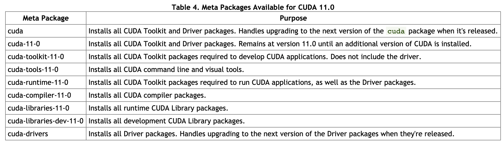

import post from '../../templates/post'

export const meta = {
  title: 'pytorch 和 CUDA 安装技巧',
  author: '李逸龙',
  date: '2020-08-13',
  description: '记录'
}

export default post(meta)

<!-- content starts here -->

最近打算学习一下深度学习，于是在家里的 Ubuntu 里面安装 pytorch，由于希望用上主机里面<del>本来用来打游戏</del>的 Nvidia GTX 1660 加速一下，所以必须安装 CUDA 相关的依赖。这里记录一种非常干净的安装方式。

要使用 N 卡做深度学习训练和推理，CUDA 是一定要装的，但是我们通常讲的 CUDA 其实是很多个东西的集合

[
<small>from https://docs.nvidia.com/cuda/cuda-installation-guide-linux/index.html</small>
](https://docs.nvidia.com/cuda/cuda-installation-guide-linux/index.html#package-manager-metas)

这里总结的干净方式是：只在 host Ubuntu 上安装最新的 CUDA driver，然后使用 anaconda 创建虚拟环境，在虚拟环境中安装 pytorch 和 cuda toolkit。由于 [CUDA driver 是向后兼容的](https://docs.nvidia.com/cuda/cuda-toolkit-release-notes/index.html#cuda-major-component-versions)，因此只要更新 host Ubuntu 上的 CUDA driver，今后就能不断创建独立的 conda env 隔离各个版本的 pytorch/tensorflow 和对应版本的 cuda toolkit 依赖，基本不用动 host 上的 CUDA driver 搞得鸡飞狗跳甚至开不了机了。

# 安装步骤

1. [下载并安装 CUDA Toolkit](https://developer.nvidia.com/cuda-downloads?target_os=Linux&target_arch=x86_64&target_distro=Ubuntu&target_version=2004&target_type=deblocal)，这里使用 CUDA 11.0 为例，使用 local deb 安装到 Ubuntu 20.04。需要注意的是，Base Installer 最后一步仅安装 cuda driver：`sudo apt-get -y install cuda-driver`。
2. 安装 Anaconda，这个按照官网文档安装就好，没有 surprise。
3. 创建 conda env，以 pytorch 1.6 为例：`conda create pytorch1.6; conda activate pytorch1.6`。
   1. 为了提速，可以设置 anaconda [使用清华大学镜像源](https://mirrors.tuna.tsinghua.edu.cn/help/anaconda/)。
4. 安装 pytorch 和 CUDA 依赖：`conda install pytorch torchvision -c pytorch`。
5. 验证 pytorch 正确使用 GPU，进入 python 交互式界面后：`import torch;torch.cuda.current_device()`。我的机器上只有一个 N 卡，因此输出 0。

至此安装完成，host 上只安装了 CUDA driver 11.0，其余所有 pytorch 依赖均隔离安装到了 pytorch16 这个 conda env 中。
